# Three-Tier Chat Application Deployment on Kubernetes

## Project Overview
This project demonstrates the deployment of a three-tier chat application on Kubernetes using a microservices-based architecture. The application consists of:

* Frontend – User interface for interacting with the chat application
* Backend – API layer handling authentication, messaging, and business logic
* MongoDB – Database layer for storing users, messages, and application data

The application was containerized and deployed on a Kubernetes cluster with proper networking and persistent storage. Below image shows the flow of deployment followed for the chat application:

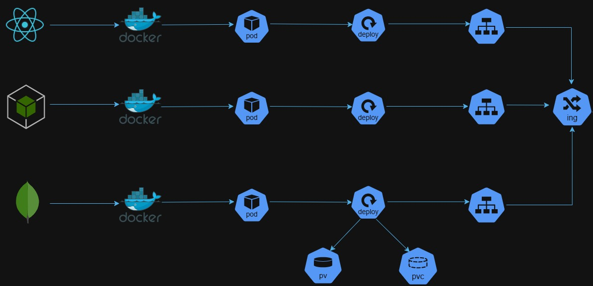

---

## Components Deployed

### 1. Frontend Tier
* Built Docker image for frontend application
* Pushed image to Docker Hub
* Created Kubernetes Deployment
* Exposed application internally using Service

### 2. Backend Tier
* Built Docker image for backend API
* Pushed image to Docker Hub
* Created Kubernetes Deployment
* Configured environment variables for MongoDB connectivity
* Exposed backend using Kubernetes Service

### 3. Database Tier (MongoDB)
* Used official MongoDB container image
* Created Deployment for MongoDB
* Created Service for internal communication
* Attached persistent storage using PV and PVC

---

## Deployment Steps with Screenshots

### Step 1

We will create and push Docker images from the already provided Dockerfiles to repositories created on Docker Hub. Below commands will be used:

```
cd /Kubernetes-Projects/full-stack_chatApp/backend
docker build -t asadjvd/chatapp-backend:latest .
docker push asadjvd/chatapp-backend:latest
cd /Kubernetes-Projects/full-stack_chatApp/frontend
docker build -t asadjvd/chatapp-frontend:latest .
docker push asadjvd/chatapp-backend:latest
```

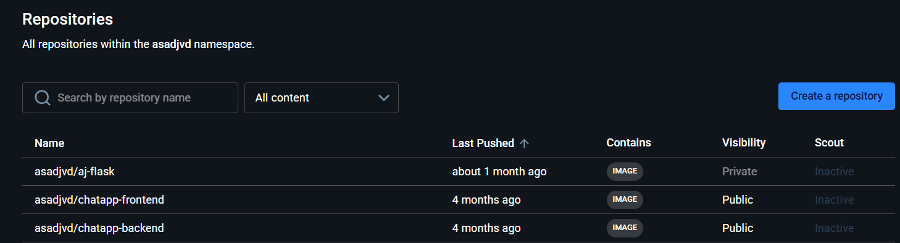

---

### Step 2 

To carry out deployment of chat application on Kubernetes, I had made use of Minikube. Once Minikube is up and running we will start with the deployment. First step I had carried out was to create a namespace where we would deploy all our Kubernetes resources. The Kubernetes manifests are present in directory Kubernetes-Projects/full-stack_chatApp/Kubernetes/. Below is the command and screenshot:

```
cd /Kubernetes-Projects/full-stack_chatApp/Kubernetes
kubectl apply -f namespace.yml
```

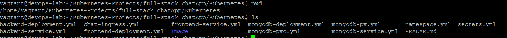

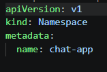

---

### Step 3 

Created Persistent Volume (PV) and Persistent Volume Claim (PVC) and then mounted them to MongoDB container for durable storage. Without persistent storage MongoDB data would be lost if pod restarts. By having PV and PVC we would ensure database data survives incase a pod gets recreated. Below are the commands used to create PV and PVC and the screenshots of the manifests used to create them:

```
kubectl apply -f mongodb-pv.yml
kubectl apply -f mongodb-pv.yml
```

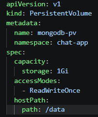

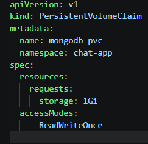

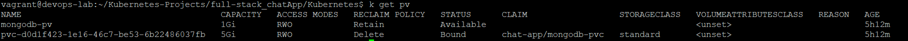

---

### Step 4

Once PV and PVC are deployed, we deploy the frontend, backend, mongodb deployments and services with a single command shared below along with the screenshot of all the resources manifests used. The deployments for each component would be used to manage pods and deployments provide benefits such as easy to scale, pods self-healing and rolling updates. Backend service was deployed as the nginx.conf file in frontend had a location (/api) that had a dependency of backend service at 5001 port. Frontend service was deployed to ensure internal access to frontend pods. MongoDB service was deployed to provide a stable DNS name for DB connectivity. 

```
cd /Kubernetes-Projects/full-stack_chatApp/Kubernetes
kubectl apply -f .
```

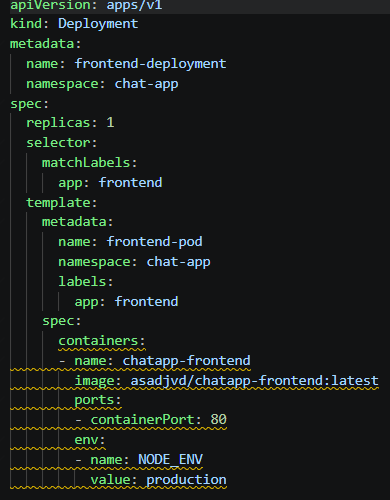

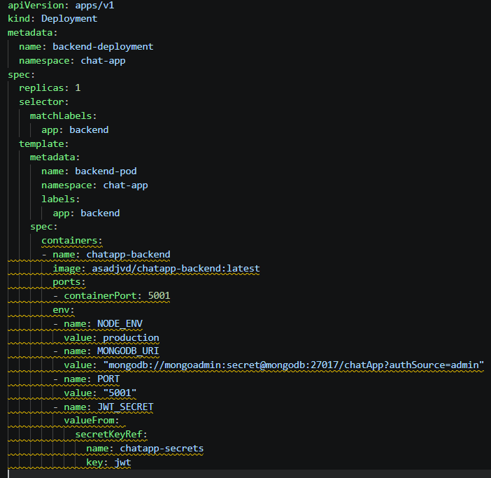

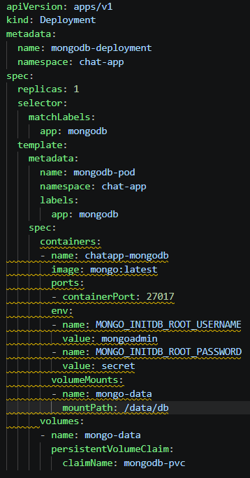

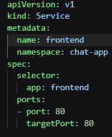

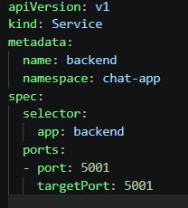

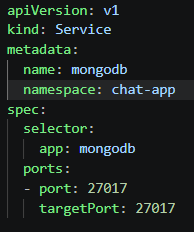

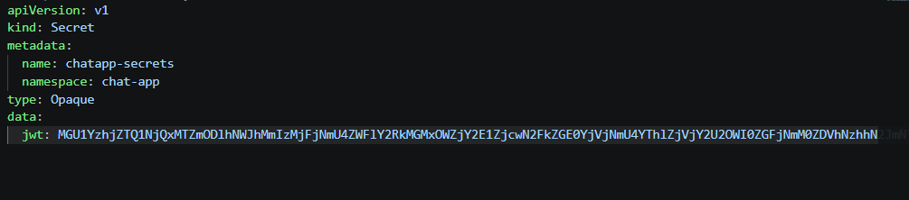

---

### Step 5

Created an Nginx Ingress resource to expose the application externally using a custom hostname. The host used was **chat-tws.com**. The routing rules defined in Ingress manifest were **/** for **frontend** and **/api** for **backend**. Ingress provides a single entry point and helps route HTTP/HTTPS traffic to services deployed for the application. To enable Nginx Ingress Controller on Minikube I had to use an additional command shared below:

```
minikube addons enable ingress
```

To verify access to application using a web browser on my local machine I used **kubectl port-forward** which is used to temporarily expose a Kubernetes pod or service to a local machine without changing service types or creating external access resources. The **kubectl port-forward** command used is shared below. I had also created custom host entry in local hosts file found on path **C:\Windows\System32\drivers\etc\hosts** where I had mapped my VMs IP to the host name defined in Ingress Resource manifest as shown in screenshot below:

```
kubectl port-forward --address 0.0.0.0 -n ingress-nginx service/ingress-nginx-controller 8080:80 &
```

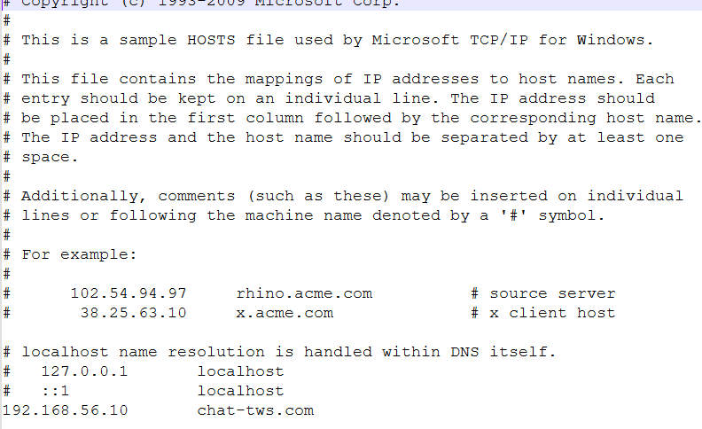

Below is the screenshot of the Nginx Ingress resource that has rules for path-based routing defined in manifest:

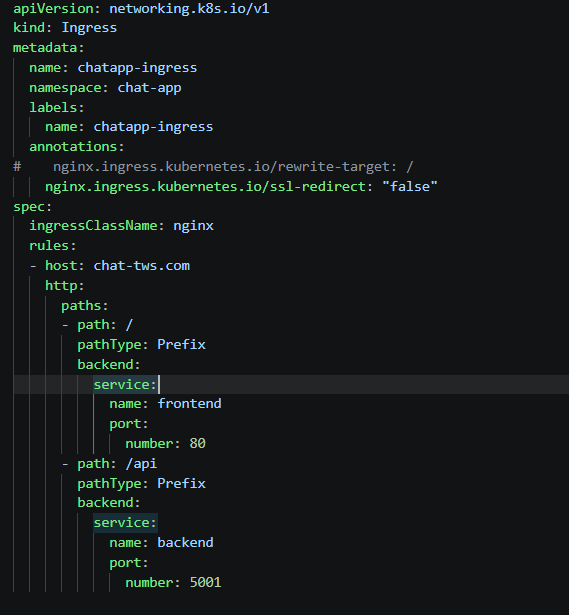

---

### Step 6

To validate all the deployed Kubernetes resources were working properly and not throwing errors I used command as shared in screenshot:

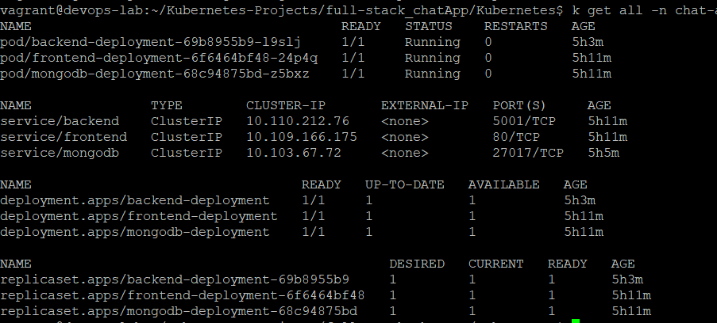

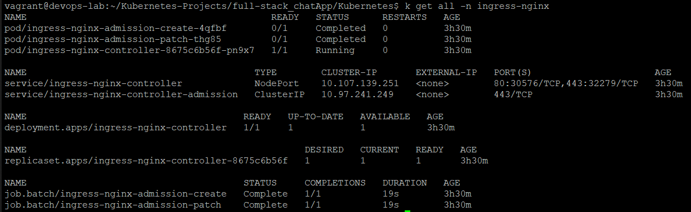

To verify the frontend UI was accessible I used **http://chat-tws.com:8080** to access it as shown in screenshot below:

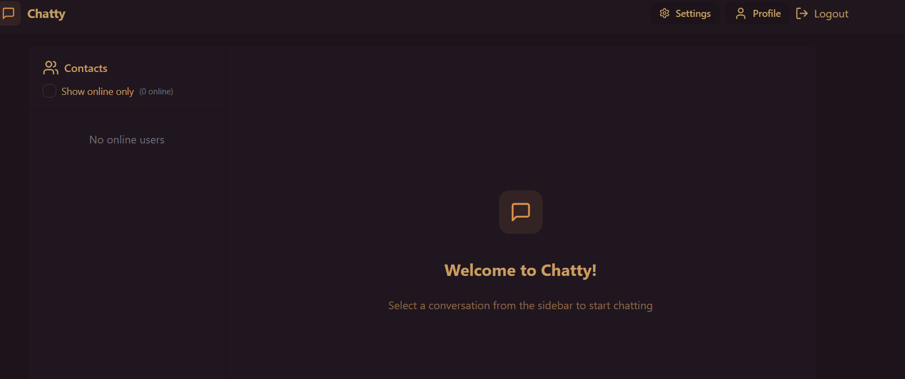

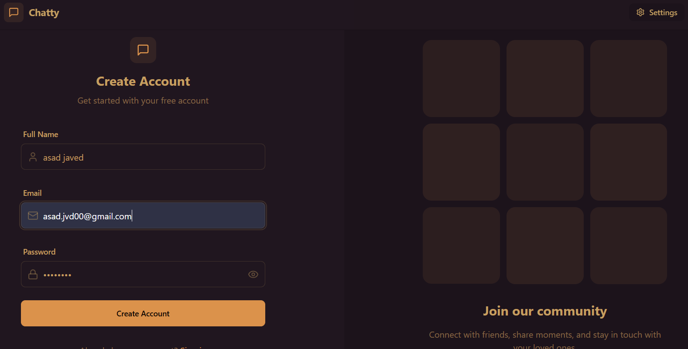

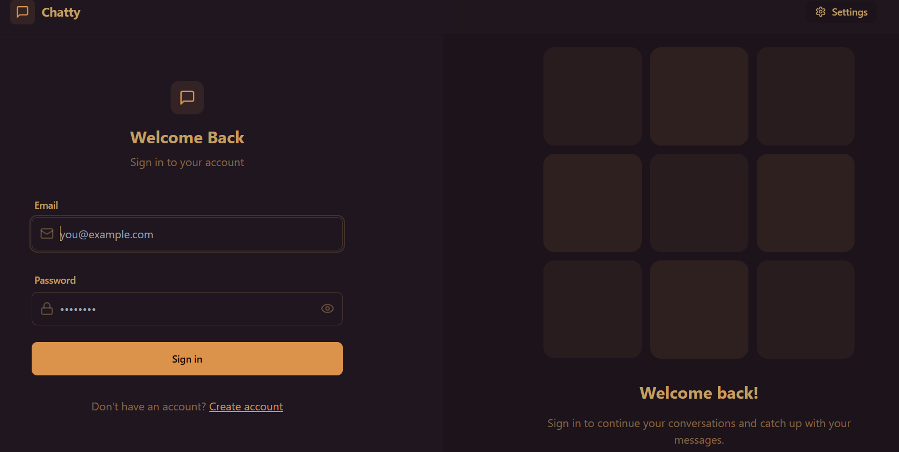

---

## Skills Demonstrated

* Docker containerization
* Kubernetes Deployments and Services
* Ingress Controller configuration
* Path-based routing
* Persistent storage (PV/PVC)
* Kubernetes DNS troubleshooting
* Full-stack microservices deployment

---

## Outcome

Successfully deployed a three-tier chat application on Kubernetes with:

* Scalable frontend/backend services
* Persistent MongoDB storage
* Internal service discovery
* External access through Ingress
* Production-style routing architecture

---
